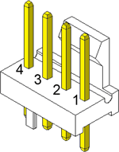

# esp-pc-fan


Common 4-pin PWM fan controller.

## Usage

To reference this library by your project, add it as git submodule, using command

```shell
git submodule add https://github.com/mdvorak-iot/esp-pc-fan.git components/pc_fan
```

and include either of the header files

```c
#include <pc_fan_control.h>
#include <pc_fan_rpm.h>
```

For full example, see [pc_fan_example_main.c](./example/main/pc_fan_example_main.c).

### Sampling

When using sampling, ideal number of samples used for average depends on sampling interval, 
and desired response time to changes. More samples provides best accuracy, but also react
to RPM changes slowly.

Good values are 5 samples and sampling every 200 ms - that is, average on last second. 

## 4-Wire Fan Pins

Standard pinout of PC PWM controlled fan.



| Pin | Name    | Common Color
| --- | ----    | --- 
| 1   | GND     | black
| 2   | +12VDC  | yellow
| 3   | Sense   | green
| 4   | Control | blue

This applies to 3-PIN fan as well, except voltage on PIN 2 is used to control the RPM, and PIN 4 is obviously missing.
